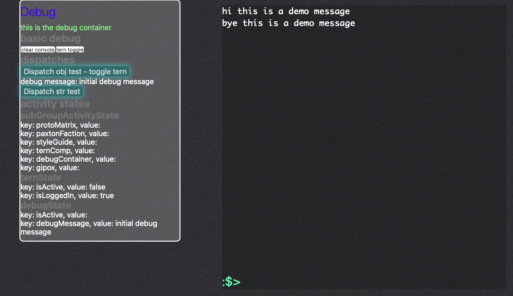

Übersicht | Termite Widget
=================
:closed_book: [Übersicht Homepage](http://tracesof.net/uebersicht/)
&nbsp;&nbsp;&nbsp;:pushpin: [Übersicht Widgets](http://tracesof.net/uebersicht-widgets/)
&nbsp;&nbsp;&nbsp;:page_facing_up: [Widgets GitHub Repo](https://github.com/felixhageloh/uebersicht-widgets)

> A widget that allows you to run commands in terminal.

## Installation

Just put the termite.widget folder in your widgets folder.

## Configuration

For the moment all configuration is inside the widget code. Will move this to external later.

## Why?

Somebody on reddit asked for help.

## Roadmap

This project needs some cleanup and demonstration of other aspects of using Übersicht. It could also do with easy config and a way to toggle debug as well as hiding and showing on demand.

* First we'll need proper versioning and cleanup then seperation of parts like utils into other files.
* Next we'll need to add some basic features like fetch, geolocation, running scripts etc.
